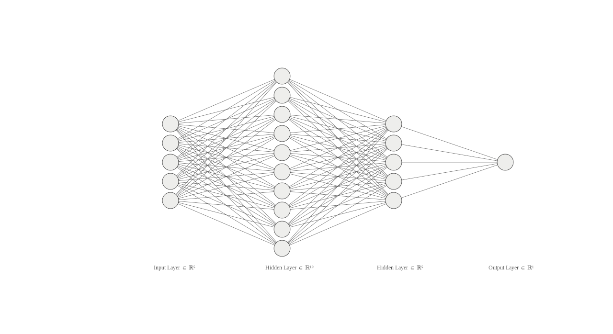

## یادداشت نکات و یافته ها

می تونی نکات و یافته هات از آزمایش ها را در یک فایل بنویسی ... این فایل README.md که در پوشه اصلی zeinab هست مطالب اینجا رو نشون می ده اما در هر فولدر هم می تونی یک فایل README.md ایجاد کنی. برای اینکه دسته بندی بشه من اینجا یک سری فولدر ایجاد کردم و داخل هر فولدر یک فایل README.md هست که برای ثبت اطلاعات و یا یادداشت و غیره می تونه مورد استفاده قرار بگیره... یک سری توضیحات در مورد خود برنامه را در خود فولدر NN پایین همین بخش می تونی بخونی.

فولدرها رو دسته بندی کردم و فولدر خود مقاله paper1 هست. برای نوشتن و تغییر این فایل و فایلهای مشابه از همون notepad++ استفاده کن که از لینک زیر دانلودش کن

https://notepad-plus-plus.org/downloads/v8.6.2/

به فولدر NN کیلک کن و به انتهای صفحه مراجعه کن تا توضیحات رو ببینی

## ایجاد نمودار شبکه عصبی
برای ترسیم شبکه عصبی از سایت زیر استفاده کن

https://alexlenail.me/NN-SVG/

نمونه شبکه عصبی ایجاد شده که در فولدر خود مقاله با نام mlp.png قرار دارد.

